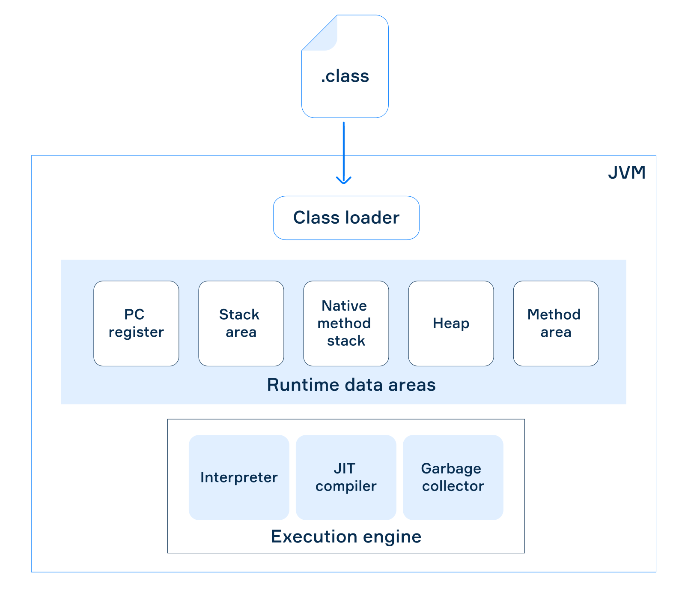

# Introduction

Java is a high-level, class-based, object-oriented programming language. Its syntax was influenced by C and C++. Java abstracts away many low-level programming complexities. For example, Java does not support C++-style multiple inheritance of classes, and memory management is handled automatically through garbage collection.

---

# How Java Works

Java source code such as `Main.java` is compiled by the Java compiler (`javac`) into bytecode by producing a `.class` file. The bytecode can run on any platform that has a compatible Java Virtual Machine (JVM). This is the idea behind Java's **"write once, run anywhere"** approach.

The JVM executes the bytecode and can translate/compile it into native machine instructions that can be executed by the CPU.

- *JVM (Java Virtual Machine)* — executes Java bytecode.
- *JRE (Java Runtime Environment)* — provides the JVM and libraries needed to run Java applications.
- *JDK (Java Development Kit)* — provides the tools needed to develop Java applications, including the compiler (`javac`) and the Java runtime components.

## Java Execution Flow

```text
Main.java
    ↓
  javac
    ↓
Main.class
 (bytecode)
    ↓
   JVM
    ↓
Native machine instructions
    ↓
   CPU
```

## JVM Internals Overview

After the compilation of a Java program, there is a file with the **`.class`** extension. It contains the Java bytecode. In order to execute the code, it needs to get loaded it into the JVM. When the JVM executes a program, it translates the bytecode into platform-native code.

The JVM mainly performs the following activities:

- Loads bytecode
- Verifies bytecode
- Executes bytecode
- Provides the runtime environment

The following image illustrates a common JVM architecture:




### The Class Loader Subsystem

This subsystem loads the Java bytecode for execution, verifies it and then allocates memory for the bytecode. 
To verify bytecode, there is a module called the **bytecode verifier**. It checks that the instructions don't require any dangerous actions, such as accessing private fields and methods of classes and objects.


### The Runtime Data Areas

This **subsystem** represents **JVM memory**. The areas are used for different purposes during program execution.

- **PC register** — holds the address of the currently executing instruction.
- **Stack area** — a memory area where method calls and local variables are stored.
- **Native method stack** — stores native method information.
- **Heap** — stores all created objects (instances of classes).
- **Method area** — stores class-level information such as the class name, immediate parent class name, method information     and static variables.

Every thread has its own **PC register**, **stack** and **native method stack** but all threads share the same **heap** and **method area**.


### Execution Engine

The execution engine is responsible for executing the program (bytecode). It interacts with various data areas of the JVM while executing bytecode.

The execution engine has the following parts:

- **Bytecode interpreter** — interprets the bytecode line by line and executes it (rather slowly).
- **Just-in-time compiler (JIT compiler)** — translates bytecode into native machine language while executing the program.     It executes the program faster than the interpreter.
- **Garbage collector** — cleans unused objects from the heap. Different JVM implementations can contain both a **bytecode     interpreter** and a **just-in-time compiler**, or only one of them.
- 

### Interfaces and Libraries

Other important parts of the JVM for execution include:

- **Native Method Interface** — provides an interface between Java code and native method libraries.
- **Native Method Library** — consists of C/C++ files that are required for the execution of native code.

---

# Concepts

## Getting Started

### Java Program Structure

A Java program is made up of classes, methods, statements and expressions. A simple Java program looks like this:

```java
public class Main {
    public static void main(String[] args) {
        System.out.print("I'm Learning Java!");
    }
}
```

- `class` — a blueprint that can contain data and behavior. Java code is organized into classes.
- `Main` — the name of the class.
- `public` — an access modifier that allows something to be accessed from other classes.
- `static` — means the method belongs to the class rather than a particular object.
- `void` — means the method does not return a value.
- `main()` — the entry point of a Java application. Program execution starts here.
- `String[] args` — an array of strings that can contain command-line arguments.
- `System.out` — provides access to the standard output stream.
- `print()` — prints something.
- `println()` — prints something and moves to the next line.


### Statements

A statement is an instruction that tells the program to perform an action. For example:

```java
int age = 24;
System.out.print(age);
```

The semicolon (`;`) marks the end of a statement in Java.


### Variables and Data Types

A variable is a named place used to store a value. Every variable has a **data type**, which determines what kind of value it can hold.

```java
int age = 24;
String name = "Taneem";
boolean isAdult = true;
```

- `age` is an `int`.
- `name` is a `String`.
- `isAdult` is a `boolean`.

Java has two broad categories of types:

**Primitive types** store simple values directly, such as:

```text
byte
short
int
long
float
double
char
boolean
```

**Reference types** refer to objects, such as `String` and arrays.


### Output

Java provides `System.out.print()` and `System.out.println()` to display output.

`print()` displays the value without automatically moving to the next line.

`println()` displays the value and then moves to the next line.

```java
System.out.print("I'm Learning");
System.out.print("Java!");
```

Output:

```text
I'm Learning Java!
```

While:

```java
System.out.println("I'm Learning");
System.out.println("Java!");
```

Output:

```text
I'm Learning
Java!
```


### `println()` and `\n`

`println()` can be used to output a statement and move to the next line.

Instead of `println()`, the escape character `\n` can be used inside a string to move to the next line.

Strings can be concatenated by putting `+` between them.

```java
public class Main {
    public static void main(String[] args) {
        System.out.print("I'm Learning\n" + "Java!");
    }
}
```

Output:

```text
I'm Learning
Java!
```

**Background:** A string is a sequence of characters. In Java, `String` is a class and therefore a reference type.


### Variables and `var`

Java normally requires the data type to be explicitly written when declaring a variable:

```java
String language = "Java";
int version = 10;
```

`var` can be used instead of explicitly writing the type for **local variables**.

This feature, called **local variable type inference**, was introduced in Java 10.

```java
var language = "Java"; // String
var version = 10;      // int
```

The compiler determines the type from the value assigned to the variable.

`var` does not make Java dynamically typed.

```java
var language = "Java";

language = 10; // Error
```

The compiler has inferred `language` as a `String`, so an `int` cannot be assigned to it.


### Comparing Values

For primitive types, `==` compares values:

```java
int a = 10;
int b = 10;

System.out.println(a == b); // true
```

Reference types work differently. With reference types, `==` checks whether two references point to the same object.

For comparing the contents of objects, `equals()` can be used when the class provides an appropriate implementation.

```java
String s1 = new String("java");
String s2 = new String("java");
String s3 = s2;

System.out.println(s1 == s2);      // false
System.out.println(s1.equals(s2)); // true
System.out.println(s2 == s3);      // true
```

Here:

- `s1` and `s2` contain the same text but refer to different objects.
- `s3` refers to the same object as `s2`.
- Therefore, `s1 == s2` is `false`.
- `s1.equals(s2)` is `true` because their contents are equal.
- `s2 == s3` is `true` because both references point to the same object.


### Escape Characters

An escape sequence starts with a backslash (`\`) and gives special meaning to the following character inside a string.

Common escape sequences include:

| Escape | Meaning |
|---|---|
| `\n` | New line |
| `\t` | Tab |
| `\"` | Double quotation mark |
| `\\` | Backslash |

Example:

```java
System.out.println("Name:\tJohn\nAge:\t24");
```

Output:

```text
Name:   John
Age:    24
```


### Comments

Comments are notes written inside source code. They are ignored by the compiler and do not affect the program's execution.

A single-line comment starts with `//`:

```java
// This is a comment
int age = 24;
```

A multi-line comment starts with `/*` and ends with `*/`:

```java
/*
    This is a
    multi-line comment.
*/
```


### User Input with `Scanner`

Java can receive input from the user using the `Scanner` class. It is available in the `java.util` package, so it needs to be imported before it can be used.

```java
import java.util.Scanner;

public class Main {
    public static void main(String[] args) {
        Scanner scanner = new Scanner(System.in);

        String name = scanner.next();

        System.out.println("Hello, " + name);

        scanner.close();
    }
}
```

`System.in` represents the standard input, while `Scanner` provides methods for reading different types of input.

Some commonly used methods are:

| Method | Reads |
|---|---|
| `next()` | The next word/token |
| `nextLine()` | The entire current line |
| `nextInt()` | An integer |
| `nextDouble()` | A decimal number |

For example:

```java
String name = scanner.next();
int age = scanner.nextInt();
double height = scanner.nextDouble();
```

`next()` reads input separated by whitespace, while `nextLine()` reads everything until the end of the current line.

For example, if the input is:

```text
Mahbubur Rahman
```

then:

```java
scanner.next();     // Mahbubur
scanner.next();     // Rahman
```

while:

```java
scanner.nextLine(); // Mahbubur Rahman
```

**Background:** `Scanner` is a class provided by Java's standard library. It can read input from different sources, including keyboard input through `System.in`.

---

## Arithmetic and primitive type operations

### Arithmetic Operations

Arithmetic operators are used to perform mathematical calculations in Java. Java provides five **binary arithmetic operators**: addition `+`, subtraction `-`, multiplication `*`, division `/`, and remainder `%`.

```java
System.out.println(13 + 25); // 38
System.out.println(70 - 30); // 40
System.out.println(21 * 3);  // 63
```

Binary operators are called **binary** because they take two values as operands.

When two integer values are divided using `/`, Java returns only the **integer part** of the result. The fractional part is discarded.

```java
System.out.println(8 / 3);  // 2
System.out.println(41 / 5); // 8
```

The `%` operator returns the **remainder** of a division.

```java
System.out.println(10 % 3); // 1
System.out.println(12 % 4); // 0
System.out.println(5 % 9);  // 5
```


### Expressions

Multiple arithmetic operations can be combined to create more complex **expressions**.

```java
System.out.println(1 + 3 * 4 - 2); // 11
```

Java follows a specific **precedence order** when evaluating expressions. Multiplication, division and remainder have a higher precedence than addition and subtraction.

**Parentheses** can be used to specify the order of execution and can also be nested.

```java
System.out.println((1 + 3) * (4 - 2)); // 8
```


### Unary Operators

A **unary operator** takes a single value as its operand.

The **unary plus** operator indicates a positive value. It is optional.

```java
System.out.println(+5); // 5
```

The **unary minus** operator negates a value or an expression.

```java
System.out.println(-8);          // -8
System.out.println(-(100 + 4));  // -104
```

Unary plus and unary minus have a higher precedence than multiplication and division.


### Precedence

Java has a precedence order for arithmetic operators from **highest to lowest**:

1. Parentheses `()`
2. Unary plus/minus `+` `-`
3. Multiplication, division, and remainder `*` `/` `%`
4. Addition and subtraction `+` `-`

Example of arithmetic operations:

```java
public class Expressions {
    public static void main(String[] args) {
        int a = 5, b = 11;
        System.out.println(b + a); // Prints 16

        System.out.println(b - a); // Prints 6

        System.out.println(b * a); // Prints 55

        System.out.println(b / a); // Prints 2

        System.out.println(b % a); // Prints 1

        System.out.println((a - b) + a * (b - a) - a % b); // Prints 19

    }
}
```


### Integer Types

Java provides integer types for representing whole numbers including positive, negative, and zero. The most commonly used types are `int` and `long`. `int` can store a smaller range of numbers while `long` can store much larger values.

```java
int two = 2;
int ten = 10;

int twelve = two + ten; // 12
int eight = ten - two;  // 8
int twenty = two * ten; // 20
int five = ten / two;   // 5
int zero = ten % two;   // 0

int minusTwo = -two; // -2
```

An `int` variable can also be printed using `System.out.println()`.

```java
int number = 100;
System.out.println(number); // 100
```


### Long

The `long` type is used for integer values that are too large for `int`. The underscore `_` can be used to separate groups of digits to make large numbers easier to read.

```java
long one = 1L;
long twentyTwo = 22L;
long bigNumber = 100_000_000_000L;

long result = bigNumber + twentyTwo - one;
System.out.println(result); // 100000000021
```

A number ending with `L` or `l` is treated as a `long`. Otherwise, an integer literal is treated as an `int`.

```java
int bigNumber = 5_000_000_000; // Does not compile
```

The value is too large for an `int` but adding `L` makes it a `long`.

```java
long bigNumber = 5_000_000_000L; // Compiles successfully
```


### Assignment Operators

The assignment operator `=` assigns a value to a variable.

```java
int n = 10;
n = n + 4; // 14
```

Java also provides **compound assignment operators** that combine an operation with assignment. For example, `+=` can be used instead of repeating the variable name.

```java
int n = 10;
n += 4; // 14
```

Other compound assignment operators include:

```text
+=
-=
*=
/=
%=
```


### Increment and Decrement Operators

Java has two opposite operations called **increment** (`++`) and **decrement** (`--`) which increase or decrease the value of a variable by one.

```java
int n = 10;
n++; // 11
n--; // 10
```

The code above is equivalent to:

```java
int n = 10;
n += 1; // 11
n -= 1; // 10
```


### Prefix and Postfix Forms

Both increment and decrement operators have two forms:

- **Prefix** (`++n` or `--n`) changes the value of a variable **before** it is used.
- **Postfix** (`n++` or `n--`) changes the value of a variable **after** it is used.

#### Prefix Increment

```java
int a = 4;
int b = ++a;

System.out.println(a); // 5
System.out.println(b); // 5
```

Here, `a` is incremented first and then its new value is assigned to `b`.

#### Postfix Increment

```java
int a = 4;
int b = a++;

System.out.println(a); // 5
System.out.println(b); // 4
```

Here, the original value of `a` is assigned to `b` first and then `a` is incremented. Therefore, `b` is `4` and `a` is `5`.

The same prefix and postfix behavior applies to the decrement operator.

```java
int a = 4;
int b = --a; // a = 3, b = 3

int x = 4;
int y = x--; // x = 3, y = 4
```

For example:

```java
int a = 16;
int b = 4;
int remainder = --a % b++;
System.out.println(remainder); // Prints 3
```


### Boolean Type

The `boolean` is a data type that has only two possible values: `true` and `false`. It is also known as the **logical type**.

```java
boolean open = true;
boolean closed = false;

System.out.println(open);   // true
System.out.println(closed); // false
```

A `boolean` variable cannot store an integer value. In Java, `0` is not the same as `false`.


### Logical Operators

Boolean variables are often used to build logical expressions. Java has four logical operators: **NOT**, **AND**, **OR** and **XOR**.

**NOT** `!` is a unary operator that reverses a boolean value.

```java
boolean f = false;
boolean t = !f; // true
```

**AND** `&&` is a binary operator that returns `true` only when both operands are `true`.

```java
boolean b1 = false && false; // false
boolean b2 = false && true;  // false
boolean b3 = true && false;  // false
boolean b4 = true && true;   // true
```

**OR** `||` is a binary operator that returns `true` when at least one operand is `true`.

```java
boolean b1 = false || false; // false
boolean b2 = false || true;  // true
boolean b3 = true || false;  // true
boolean b4 = true || true;   // true
```

**XOR** `^` (exclusive OR) is a binary operator that returns `true` when the operands have different values. It returns `false` when they have the same value.

```java
boolean b1 = false ^ false; // false
boolean b2 = false ^ true;  // true
boolean b3 = true ^ false;  // true
boolean b4 = true ^ true;   // false
```


### Logical Operator Precedence

The logical operators are evaluated in the following order from **highest to lowest precedence**:

1. `!` — NOT
2. `^` — XOR
3. `&&` — AND
4. `||` — OR

For example:

```java
boolean b = true && !false; // true
```

Here, `!false` is evaluated first, producing `true` and then `true && true` produces `true`.

Parentheses can be used to change the order of execution.


### Short-Circuit Evaluation

The `&&` and `||` operators use **short-circuit evaluation**, meaning they do not evaluate the second operand when the result can already be determined from the first operand.

```text
false && ... → false
true  || ... → true
```

For `&&`, if the first operand is `false`, the entire expression must be `false`, so the second operand is not evaluated.

For `||`, if the first operand is `true`, the entire expression must be `true`, so the second operand is not evaluated.

Short-circuit evaluation can reduce unnecessary computation and can also help avoid some errors in programs.


### Division and Remainder

Division can produce a whole-number quotient or a quotient with a fractional part. When one number is not a multiple of another, the division can be described using a **quotient** and a **remainder**.

For example:

```text
6 / 2 = 3
7 / 2 = 3.5
```

The number being divided is the **dividend**, the number we divide by is the **divisor**, and the result is the **quotient**.

For integer division, the relationship can be represented as:

```text
6 = 3 × 2 + 0
7 = 3 × 2 + 1
```

The last value is the **remainder**. It represents what is left after subtracting the maximum possible multiple of the divisor from the dividend.

The remainder is always a non-negative integer that is strictly less than the divisor when working with positive numbers.


### Modulo Division

The **modulo** operation returns the remainder of a division.

If:

```text
x = n × y + z
0 ≤ z < y
```

then:

```text
x mod y = z
```

For example:

```text
6 mod 2 = 0
7 mod 2 = 1
```

If `x` is smaller than `y`, then:

```text
x mod y = x
```

In Java, the modulo operator is written as `%`.

```java
System.out.println(10 % 3); // 1
System.out.println(12 % 4); // 0
System.out.println(5 % 9);  // 5
```

A number is divisible by another number if and only if the remainder is `0`.

```java
x % y == 0
```

For example, a number is **even** if it is divisible by `2`, so we can check it with:

```java
x % 2 == 0
```


### Using Modulo with Time

The modulo operator can also be used to convert a `24`-hour time to a `12`-hour format.

For example:

```text
16 mod 12 = 4
```

Because:

```text
16 = 1 × 12 + 4
```

Therefore, `16` o'clock corresponds to `4` p.m. in the `12`-hour format.

The general idea is to take the `24`-hour time modulo `12`.


### Why Modulo Is Useful

The modulo operator is useful in many programming tasks, such as checking divisibility, determining whether a number is even or odd, and working with repeating cycles such as time.

It is also used in areas such as **cryptography** and computations involving very large numbers. For example, knowing that:

```text
x mod 25 = 3
```

means that `x` can have the form:

```text
x = n × 25 + 3
```

where `n` is a natural number. Therefore, many different values of `x` can produce the same remainder.


### Binary Number System

The **binary numeral system**, or **base-2 numeral system**, represents numbers using only two digits: `0` and `1`. Each digit is called a **bit** (**bi**nary digi**t**).

Unlike the decimal system, which uses powers of `10`, the binary system uses powers of `2`.

For example, the decimal number `4251` can be represented as:

```text
4 × 10³ + 2 × 10² + 5 × 10¹ + 1 × 10⁰
```

A binary number works in the same way, but uses powers of `2`. For example, binary `1011` is:

```text
1 × 2³ + 0 × 2² + 1 × 2¹ + 1 × 2⁰
```


### Binary Counting

Binary counting uses only `0` and `1`.

| Decimal | Binary | Powers of Two |
|---:|---:|---|
| `0` | `0` | `0 × 2⁰` |
| `1` | `1` | `1 × 2⁰` |
| `2` | `10` | `1 × 2¹ + 0 × 2⁰` |
| `3` | `11` | `1 × 2¹ + 1 × 2⁰` |
| `4` | `100` | `1 × 2² + 0 × 2¹ + 0 × 2⁰` |
| `5` | `101` | `1 × 2² + 0 × 2¹ + 1 × 2⁰` |
| `6` | `110` | `1 × 2² + 1 × 2¹ + 0 × 2⁰` |
| `7` | `111` | `1 × 2² + 1 × 2¹ + 1 × 2⁰` |
| `8` | `1000` | `1 × 2³ + 0 × 2² + 0 × 2¹ + 0 × 2⁰` |

For example, decimal `5` is binary `101` because:

```text
1 × 2² + 0 × 2¹ + 1 × 2⁰
= 4 + 0 + 1
= 5
```

In binary counting, when a digit reaches `1`, the next number resets that digit to `0` and increases the digit to its left.


### Zero Padding

**Zero padding** means adding insignificant zeros to the left side of a binary number. It does not change the value of the number.

```text
11  → 0011
101 → 0101
```

Common fixed-length formats include:

- **Triads:** `000`, `001`, `010`
- **Tetrads:** `0110`, `0111`
- **8-digit numbers:** `00000000`, `01010101`


### Binary in Computers

Modern digital devices use the binary number system because computer hardware can represent two different states. Components such as transistors can switch between these two states.

Computer memory is also represented using binary values. Information is commonly grouped into **8 bits**, which is called a **byte**.

An 8-bit binary number can represent **256 different values**, from `0` to `255`.

This way of storing information is called **binary code** and is used to represent many types of data.


### Binary Encoding

Text can be represented using binary encoding. For example, **ASCII** (American Standard Code for Information Interchange) originally represented each character using 7 bits. Later, ASCII was modified to use 8 bits.

For example, lowercase `a` can be represented as:

```text
1100001
```

Colors can also be represented using binary values. The **RGB** (Red, Green, Blue) color system uses three values, one for each color component.

For example:

```text
(11111111, 00000000, 00000000)
```

represents pure red, with no green or blue component.

In general, binary code can be used to represent many different types of information.


### Binary Addition

Binary addition works like normal column addition, but the only digits are `0` and `1`.

Write the larger number on top, align both numbers to the right, and add from **right to left**.

Binary place values are powers of 2:

```text
... 2³  2²  2¹  2⁰
```


### Binary Addition Rules

The basic rules are:

```text
0 + 0 = 0
0 + 1 = 1
1 + 0 = 1
1 + 1 = 10
```

`10` is binary for decimal `2`.

When `1 + 1` produces `10`, write `0` in the current position and **carry `1`** to the next position.

For example:

```text
  1011
+ 0001
------
  1100
```

The carried `1` is added to the next column.


### Carrying in Binary Addition

Consider:

```text
  1011
+ 0111
------
```

Start from the right:

```text
1 + 1 = 10
```

Write `0` and carry `1`.

The next column becomes:

```text
1 + 1 + 1 = 11
```

Write `1` and carry `1` again.

Continue the same process until all columns are calculated.

The result is:

```text
  1011
+ 0111
------
 10010
```

Check in decimal:

```text
1011₂ = 11
0111₂ = 7

11 + 7 = 18

18₁₀ = 10010₂
```


### Binary Subtraction

Binary subtraction also works like decimal column subtraction.

Write the larger number on top, align the numbers to the right, and subtract from **right to left**.

The basic rules are:

```text
0 - 0 = 0
1 - 1 = 0
1 - 0 = 1
10 - 1 = 1
```


### Borrowing in Binary Subtraction

When we need to calculate:

```text
0 - 1
```

we cannot subtract `1` directly from `0`, so we **borrow `1` from the next digit**.

In binary, borrowing `1` gives us `10₂`, which equals decimal `2`.

Therefore:

```text
10₂ - 1₂ = 1₂
```

For example:

```text
  1100
- 0001
------
  1011
```

The borrowing process is similar to decimal subtraction, but the borrowed value is `10₂` instead of `10₁₀`.


### Borrowing Multiple Times

Sometimes there are several zeros between the digit we need to borrow from and the current digit.

For example:

```text
10000₂ - 1₂
```

We need to borrow through the zeros.

The result is:

```text
01111₂
```

So:

```text
10000₂ - 1₂ = 01111₂
```

or simply:

```text
10000₂ - 1₂ = 1111₂
```


### Checking Binary Calculations

A useful way to verify binary addition or subtraction is to convert the numbers to decimal.

For example:

```text
11010110₂ = 214
111010₂   = 58

214 - 58 = 156
```

And:

```text
156₁₀ = 10011100₂
```

Therefore:

```text
11010110₂ - 111010₂ = 10011100₂
```

The same method can be used to check binary addition.


#### Key Points

- Binary addition and subtraction use the same **column method** as decimal arithmetic.
- Always calculate from **right to left**.
- In addition, `1 + 1 = 10₂`, **carry `1`**.
- In subtraction, when `0 - 1` occurs, **borrow `1`** from the next position.
- A borrowed `1` in binary gives `10₂`, which equals decimal `2`.
- Leading zeros can be added to make numbers easier to align.
- Converting the final answer to decimal is a useful way to check the calculation.


### Implicit Casting

**Implicit casting** is when Java automatically converts a value from one data type to another without requiring the programmer to write the conversion explicitly.

It generally works when the **target type is wider** than the source type, meaning it can represent all possible values of the source type.

For example:

```java
int num = 100;
long bigNum = num; // 100
```

Here, Java automatically converts the `int` value to `long`.


### Common Implicit Castings

Some common widening conversions are:

```text
byte → short → int → long → float → double
```

`char` can also be implicitly converted to an integer type such as `int`.

For example:

```java
int num = 100;
long bigNum = num;

short shortNum = 100;
int num2 = shortNum;

char ch = '?';
int code = ch; // 63
```

A value can generally be assigned implicitly to a type further along the widening conversion path.

However, the reverse direction is not automatically allowed.

For example:

```java
long bigNum = 100;
int num = bigNum; // compilation error
```

The conversion from `long` to `int` requires explicit casting.


### Implicit Casting and Information Loss

Widening a type does not always guarantee that the exact value will be preserved.

For example, converting an integer to `float` can cause a **loss of precision** because `float` cannot represent every large integer exactly.

```java
long bigLong = 1_200_000_002L;
float bigFloat = bigLong; // 1.2E9
```

The value is within the range of `float` but some less significant bits may be lost.


### `char` and Numeric Types

A `char` can be implicitly converted to an integer type.

Java uses Unicode character representation and the values `0`–`127` have the same numeric values as ASCII.

For example:

```java
char character = 'a';
char upperCase = 'A';

int code1 = character;  // 97
int code2 = upperCase;  // 65
```

So:

```text
'a' → 97
'A' → 65
'?' → 63
```


### Boolean Cannot Be Cast

`boolean` is not part of the numeric casting system.

For example:

```java
boolean value = true;

// int num = value; // invalid
```


### Explicit Casting

When Java cannot automatically perform the conversion, the programmer can use **explicit casting**.

The syntax is:

```java
(targetType) source
```

For example:

```java
double d = 2.00003;

long l = (long) d; // 2
```

The cast from `double` to `long` removes the fractional part.


### Examples of Explicit Casting

```java
double d = 2.00003;

long l = (long) d; // 2

int i = (int) l; // 2

int val = (int) (3 + 2L); // 5

char ch = (char) 55L; // '7'
```

Explicit casting is required when converting from a wider type to a narrower type.


### Narrowing Can Lose Information

A narrower type may not be able to represent the original value.

For example:

```java
long bigNum = 100_000_000_000_000L;
int n = (int) bigNum;
```

The resulting `int` does not contain the original value.


### Type Overflow

When a value cannot be represented correctly by the target type, the conversion can result in **overflow** or loss of information.

For example:

```java
long bigNum = 100_000_000_000_000L;
int n = (int) bigNum;
```

The `long` can store a much larger range of values than `int`, so converting a large `long` to `int` can produce a different value.

The same issue can occur when converting:

```text
long → int
int  → short
int  → byte
```

Before narrowing a value, make sure the value can safely fit inside the target type.


### Explicit Casting Can Also Be Used for Widening

Explicitly casting even when Java would perform the conversion automatically.

```java
int num = 10;
long bigNum = (long) num;
```

However, this is unnecessary because Java already allows:

```java
int num = 10;
long bigNum = num;
```

Therefore, unnecessary explicit casts should generally be avoided.


#### Key Points

- **Implicit casting** is automatic conversion performed by Java.
- It normally happens when converting from a **narrower type to a wider type**.
- Example: `int → long`.
- **Explicit casting** requires the programmer to specify the target type.
- Syntax: `(targetType) value`
- Example: `(int) 3.14` produces `3`.
- Narrowing conversions can cause **loss of information or precision**.
- `char` can be converted to numeric types.
- `boolean` cannot be cast to or from numeric types.
- Explicit casting is unnecessary when Java already performs the conversion implicitly.

---

## Control flow and Conditional Logic

### Relational Operators

**Relational operators** are used to compare values. The result of a comparison is always a `boolean`: either `true` or `false`.

Java provides six relational operators:

```text
==    equal to
!=    not equal to
>     greater than
>=    greater than or equal to
<     less than
<=    less than or equal to
```

For example:

```java
int one = 1;
int two = 2;
int three = 3;
int four = 4;

boolean oneIsOne = one == one; // true

boolean res1 = two <= three; // true
boolean res2 = two != four;  // true
boolean res3 = two > four;   // false
boolean res4 = one == three; // false
```


### Relational Operators with Arithmetic

Relational operators can be used together with arithmetic operators.

Arithmetic operations are evaluated before the comparison.

```java
int number = 1000;

boolean result = number + 10 > number + 9;
```

First, the arithmetic operations are calculated:

```text
1010 > 1009
```

So:

```text
result = true
```

Relational operators have **lower priority** than arithmetic operators.


### Combining Relational Operations

Java does not allow chained comparisons such as:

```java
a <= b <= c
```

Instead, use logical operators such as `&&` and `||` to combine separate boolean expressions.

For example, to check whether `number` is between `100` and `200`:

```java
number > 100 && number < 200;
```

This means:

```text
number is greater than 100
AND
number is less than 200
```

Parentheses can make the expression easier to read:

```java
(number > 100) && (number < 200);
```

Parentheses are not required here because relational operators have higher priority than logical operators.


### Checking a Range

A variable can be checked against lower and upper boundaries:

```java
int number = 150;
int low = 100;
int high = 200;

boolean inRange = number > low && number < high;
```

`inRange` is `true` because `150` is greater than `100` and less than `200`.

Both conditions must be true because `&&` means **AND**.


### Example: Checking Descending Order

Suppose three heights are given, and we want to check whether they are arranged in descending order.

```java
import java.util.Scanner;

public class CheckDescOrder {
    public static void main(String[] args) {
        Scanner scanner = new Scanner(System.in);

        int h1 = scanner.nextInt();
        int h2 = scanner.nextInt();
        int h3 = scanner.nextInt();

        boolean descOrdered = (h1 >= h2) && (h2 >= h3);

        System.out.println(descOrdered);
    }
}
```

For this input:

```text
185 178 172
```

The result is:

```text
true
```

Because:

```text
185 >= 178  → true
178 >= 172  → true
```

Both conditions are true, so the final result is `true`.

For this input:

```text
181 184 177
```

The result is:

```text
false
```

Because:

```text
181 >= 184  → false
184 >= 177  → true
```

One condition is false, so the `&&` expression is `false`.


### Boolean Result Without a Variable

You do not always need to store the result in a separate variable.

You can directly print the expression:

```java
System.out.println((h1 >= h2) && (h2 >= h3));
```

However, when a condition becomes long or complicated, storing it in a well-named variable can make the code easier to understand:

```java
boolean descOrdered = (h1 >= h2) && (h2 >= h3);
```

The variable name `descOrdered` makes the purpose of the condition clear.


#### Key Points

- Relational operators compare values.
- Their result is always `true` or `false`.
- Java has six relational operators: `==`, `!=`, `>`, `>=`, `<`, `<=`.
- Arithmetic operations have higher priority than relational operators.
- Java does not support chained comparisons like `a <= b <= c`.
- Use logical operators such as `&&` and `||` to combine comparisons.
- Parentheses can improve readability.
- A well-named boolean variable can make a complex condition easier to understand.


### Conditional Statements

A **conditional statement** allows a program to perform different actions depending on whether a **Boolean expression** is `true` or `false`.

A Boolean expression produces either `true` or `false`.

Examples:

```java
a > b
i - j == 1
number % 2 == 0
```

Java provides several forms of conditional statements, including `if`, `if-else`, and `if-else-if`.


### The `if` Statement

The simplest form of a conditional statement is `if`.

```java
if (expression) {
    // statements to execute if expression is true
}
```

If the expression is `true`, the code inside the block is executed.

If it is `false`, the program skips the block.

For example:

```java
int age = 101;

if (age > 100) {
    System.out.println("Very experienced person");
}
```

The message is printed only when `age > 100` is `true`.


### Boolean Variables in Conditions

When the condition is already stored in a `boolean` variable, you do not need to compare it with `true` or `false`.

Instead of:

```java
boolean b = true;

if (b == true) {
    // do something
}
```

write:

```java
boolean b = true;

if (b) {
    // do something
}
```

To check the opposite condition, use `!`:

```java
if (!b) {
    // do something
}
```


### Nested `if` Statements

An `if` statement can be placed inside another `if` statement.

This allows a program to perform multiple levels of checks.

```java
if (condition1) {
    if (condition2) {
        // do something
    }
}
```


### The `if-else` Statement

The `if` statement can be extended with `else` to provide an alternative action when the condition is `false`.

```java
if (expression) {
    // do something
} else {
    // do something else
}
```

Only **one** of the two blocks is executed.

For example, a number can be checked to determine whether it is even or odd:

```java
int num = 10;

if (num % 2 == 0) {
    System.out.println("It's an even number");
} else {
    System.out.println("It's an odd number");
}
```

A number is even when it can be divided by `2` without a remainder.

For `num = 10`:

```text
10 % 2 == 0 → true
```

So the output is:

```text
It's an even number
```

For `num = 11`:

```text
11 % 2 == 0 → false
```

So the output is:

```text
It's an odd number
```


### The `if-else-if` Statement

When there are multiple conditions, you can use `else if`.

```java
if (expression0) {
    // do something
} else if (expression1) {
    // do something else
} else if (expression2) {
    // do something else
}
```

You can also add a final `else` for cases where none of the previous conditions are true.

For example:

```java
long dollars = 10_000;

if (dollars < 1000) {
    System.out.println("Buy a laptop");
} else if (dollars < 2000) {
    System.out.println("Buy a personal computer");
} else if (dollars < 100_000) {
    System.out.println("Buy a server");
} else {
    System.out.println("Buy a data center or a quantum computer");
}
```

For `dollars = 10_000`:

```text
10_000 < 1_000     → false
10_000 < 2_000     → false
10_000 < 100_000   → true
```

Therefore, the output is:

```text
Buy a server
```

The conditions are checked **from top to bottom**. Once a condition is `true`, its block is executed and the remaining `else if` and `else` branches are skipped.


#### Key Points

- A conditional statement allows a program to make decisions.
- Conditions are based on **Boolean expressions**.
- `if` executes a block only when its condition is `true`.
- `else` provides an alternative when the `if` condition is `false`.
- `else if` allows multiple conditions to be checked.
- Only one branch of an `if-else-if` chain is executed.
- A `boolean` variable can be used directly as a condition.
- Use `!` to negate a Boolean condition.
- `if` statements can be nested inside other `if` statements.


### Ternary Operator

The **ternary operator**, also called the **conditional operator**, evaluates a condition and chooses between two expressions.

It is a shorter way to express a simple `if-else` decision.

The general syntax is:

```java
result = condition ? trueCase : elseCase;
```

If `condition` is `true`, `trueCase` is evaluated.

If `condition` is `false`, `elseCase` is evaluated.


### Ternary Operator vs `if-else`

Suppose we want to find the larger of two numbers.

Using `if-else`:

```java
int a = ...;
int b = ...;
int max;

if (a > b) {
    max = a;
} else {
    max = b;
}
```

The same logic can be written using the ternary operator:

```java
int max = a > b ? a : b;
```

The ternary version is more concise because the result of the condition is directly assigned to `max`.


### The `?` and `:` Operators

The ternary operator uses two symbols:

```text
?
:
```

For example:

```java
int max = a > b ? a : b;
```

The structure is:

```text
condition ? trueCase : elseCase
```

So:

```text
a > b       → condition
a           → trueCase
b           → elseCase
```

If `a > b` is `true`, the result is `a`.

Otherwise, the result is `b`.


### Using the Ternary Operator with Output

The ternary operator can be used directly where an expression is expected.

For example, to determine whether a number is even or odd:

```java
int num = 10;

System.out.println(num % 2 == 0 ? "even" : "odd");
```

If `num` is `10`:

```text
10 % 2 == 0 → true
```

So the output is:

```text
even
```

If `num` is `11`:

```text
11 % 2 == 0 → false
```

The output is:

```text
odd
```


### Ternary Operator Has Three Operands

The ternary operator is called **ternary** because it operates on three parts:

```java
condition ? trueCase : elseCase
```

For example:

```java
num % 2 == 0 ? "even" : "odd"
```

The three parts are:

```text
condition → num % 2 == 0
trueCase  → "even"
elseCase  → "odd"
```

The result of this expression is a `String`.


### Nested Ternary Operators

Java allows one ternary operator to be placed inside another.

For example, we can compare two numbers and determine whether the first is equal to, greater than, or less than the second:

```java
int a = ...;
int b = ...;

String result = a == b ? "equal" :
                a > b ? "more" : "less";
```

The first condition checks:

```java
a == b
```

If it is `true`, the result is:

```text
equal
```

Otherwise, the second ternary operator checks:

```java
a > b
```

If it is `true`, the result is:

```text
more
```

Otherwise:

```text
less
```

Another example:

```java
int result = a > b ? (a > c ? a : c) : (b > c ? b : c); // It finds max of three numbers.
```

Nested ternary operators can become difficult to read, so they should be used carefully. For more complicated conditions, an `if-else` statement is often easier to understand.


#### Key Points

- The ternary operator is also called the **conditional operator**.
- It is a concise way to express a simple `if-else` decision.
- Its syntax is `condition ? trueCase : elseCase`.
- `?` separates the condition from the two possible expressions.
- `:` separates the expression used when the condition is `true` from the expression used when it is `false`.
- The ternary operator is an **expression**, so it can be used where an expression is expected.
- It can be nested, but nested ternaries can reduce readability.


### `for` Loop

A **`for` loop** is used to repeatedly execute a block of code while a condition remains `true`.

The basic syntax is:

```java
for (initialization; condition; modification) {
    // code to execute
}
```

It has three main parts:

- **Initialization** — executed once before the loop starts. Usually used to initialize the loop variable.
- **Condition** — checked before each iteration. If it is `false`, the loop stops.
- **Modification** — executed after each iteration. Usually used to increment or decrement the loop variable.

The execution order is:

```text
1. Initialization
2. Check condition
3. Execute loop body
4. Modification
5. Check condition again
6. Repeat
```

For example:

```java
int n = 9;

for (int i = 0; i <= n; i++) {
    System.out.print(i + " ");
}
```

Output:

```text
0 1 2 3 4 5 6 7 8 9
```

Here:

```text
int i = 0   → initialization
i <= n      → condition
i++         → modification
```

The variable `i` is available within the scope of the `for` loop, including its initialization, condition, modification, and body.

Loop variables are commonly named `i`, `j`, `k`, or `index`.


### Calculating a Sum with a `for` Loop

A `for` loop can be used to repeatedly perform calculations.

For example, calculating the sum of numbers from `1` to `10`:

```java
int startIncl = 1;
int endExcl = 11;

int sum = 0;

for (int i = startIncl; i < endExcl; i++) {
    sum += i;
}

System.out.println(sum);
```

Output:

```text
55
```

The loop adds:

```text
1 + 2 + 3 + ... + 10 = 55
```


### Skipping Parts of a `for` Loop

The initialization, condition, and modification parts are optional.

For example, the loop variable can be declared before the loop:

```java
int i = 10;

for (; i > 0; i--) {
    System.out.print(i + " ");
}
```

A `for` loop can even omit all three parts:

```java
for (;;) {
    // code
}
```

This creates an **infinite loop** because there is no condition that can become `false`.


### Nested `for` Loops

A `for` loop can be placed inside another `for` loop. This is called a **nested loop**.

Nested loops are useful when working with multidimensional structures such as tables and matrices.

For example:

```java
for (int i = 1; i < 10; i++) {
    for (int j = 1; j < 10; j++) {
        System.out.print(i * j + "\t");
    }
    System.out.println();
}
```

The outer loop controls the rows, while the inner loop controls the values within each row.

This produces a multiplication table from `1` to `9`.


#### Key Points

- A `for` loop repeats a block of code.
- Its basic structure is:

```java
for (initialization; condition; modification) {
    // code
}
```

- Initialization runs **once** at the beginning.
- The condition is checked **before each iteration**.
- The modification runs **after each iteration**.
- The loop stops when the condition becomes `false`.
- Any of the three parts can be omitted.
- `for (;;) ` creates an infinite loop.
- `for` loops can be nested inside other `for` loops.


### `while` Loop

A **`while` loop** repeatedly executes a block of code as long as a Boolean condition is `true`.

The basic syntax is:

```java
while (condition) {
    // code to execute repeatedly
}
```

The condition is checked **before** the loop body is executed, so `while` is a **pre-test loop**.

The execution flow is:

```text
1. Check the condition
2. If true, execute the body
3. Check the condition again
4. Repeat until the condition becomes false
```

For example:

```java
int i = 0;

while (i < 5) {
    System.out.println(i);
    i++;
}
```

Output:

```text
0
1
2
3
4
```

When `i` becomes `5`, the condition `i < 5` becomes `false`, so the loop stops.

Notice that `5` is not printed because the condition is checked before the body executes.


### Infinite `while` Loop

A `while` loop becomes infinite when its condition is always `true`.

```java
while (true) {
    // code to execute indefinitely
}
```

Infinite loops are useful in some situations, but they need a way to eventually stop if the program requires termination.


### Using `while` with Characters

A `while` loop can also be used to process characters.

For example, this program prints the English alphabet:

```java
char letter = 'A';

while (letter <= 'Z') {
    System.out.print(letter);
    letter++;
}
```

Output:

```text
ABCDEFGHIJKLMNOPQRSTUVWXYZ
```

The `++` operator moves the `char` to the next character according to its Unicode value.

After the loop finishes, `letter` becomes:

```text
[
```

because `[` comes immediately after `Z` in the Unicode character sequence.


### `do-while` Loop

A **`do-while` loop** is similar to a `while` loop, but the condition is checked **after** the loop body.

The basic syntax is:

```java
do {
    // code to execute
} while (condition);
```

Because the condition is checked after the body, the body is **always executed at least once**.

This makes `do-while` a **post-test loop**.

Compare the two:

```text
while:
condition → body → condition → body ...

do-while:
body → condition → body → condition ...
```


### Example of `do-while`

A `do-while` loop can be used to repeatedly read numbers until the user enters `0`.

```java
import java.util.Scanner;

public class DoWhileDemo {

    public static void main(String[] args) {
        Scanner scanner = new Scanner(System.in);

        int value;

        do {
            value = scanner.nextInt();
            System.out.println(value);
        } while (value != 0);
    }
}
```

For this input:

```text
1 2 4 0 3
```

The output is:

```text
1
2
4
0
```

The program stops after reading `0`.

The `3` is not processed because the condition becomes `false` after `0`.


### `while` vs `do-while`

The main difference is **when the condition is checked**.

| Loop | Condition checked | Body executes at least once? |
|---|---|---|
| `while` | Before the body | No |
| `do-while` | After the body | Yes |

Use `while` when the condition should be checked before executing the body.

Use `do-while` when the body must execute at least once.

In practice, `do-while` is used less often than `while`.


### Reading a Sequence of Unknown Length

A `while` loop is useful when you **don't know how many values the user will enter**.

`Scanner` provides `hasNextInt()` to check whether another integer is available.

```java
Scanner scanner = new Scanner(System.in);

int sum = 0;

while (scanner.hasNextInt()) {
    int elem = scanner.nextInt();
    sum += elem;
}

System.out.println(sum);
```

For example, if the input is:

```text
1 2 3
```

the program calculates:

```text
1 + 2 + 3 = 6
```

and prints:

```text
6
```

For:

```text
5 18 9 23 4
```

the result is:

```text
59
```

This is particularly useful when the number of inputs is **unknown**.


### `hasNextInt()`

`hasNextInt()` checks whether the next available input is an integer.

```java
while (scanner.hasNextInt()) {
    int number = scanner.nextInt();
    // process number
}
```

The loop continues while another integer is available.

When there is no more input, `hasNextInt()` eventually returns `false`.

When reading from the console, the program may wait for more input because it cannot know that you are finished simply because you stopped typing.

You can signal **EOF (End-Of-File)** from the console:

```text
Windows: Ctrl + Z, then Enter
Linux:   Ctrl + D
macOS:   Cmd + D
```


#### Key Points

- `while` repeats code while a condition is `true`.
- `while` checks the condition **before** executing the body.
- Therefore, a `while` loop may execute **zero times**.
- `do-while` checks the condition **after** executing the body.
- Therefore, a `do-while` loop always executes **at least once**.
- Both loops can be infinite if their condition never becomes `false`.
- `hasNextInt()` is useful for processing a sequence when the number of inputs is unknown.
- A `while` loop can contain conditional statements and other loops.


### `break` Statement

The **`break` statement** immediately terminates the loop in which it appears.

It can be used with:

- `for`
- `while`
- `do-while`

It can also be used to terminate a `case` in a `switch` statement.

Here, we focus on using `break` with loops.

For example:

```java
int i = 10;

while (true) {
    if (i == 0) {
        break;
    }
    i--;
}
```

Although the loop condition is always `true`, the `break` statement stops the loop when `i` becomes `0`.


### `break` and Nested Loops

A `break` statement only terminates the **innermost loop in which it is located**.

For example:

```java
for (int i = 0; i < 10; i++) {
    for (int j = 0; j < 10; j++) {
        System.out.print(j + " ");

        if (i == j) {
            break;
        }
    }

    System.out.println();
}
```

Here, `break` stops the inner loop controlled by `j`.

It does **not** stop the outer loop controlled by `i`.

The output is:

```text
0
0 1
0 1 2
0 1 2 3
0 1 2 3 4
0 1 2 3 4 5
0 1 2 3 4 5 6
0 1 2 3 4 5 6 7
0 1 2 3 4 5 6 7 8
0 1 2 3 4 5 6 7 8 9
```


### Stopping an Outer Loop

One way to stop an outer loop is to use a Boolean variable as a flag.

```java
boolean stopped = false;

for (int i = 0; i < 10 && !stopped; i++) {
    for (int j = 0; j < 10; j++) {
        System.out.print(j + " ");

        if (i == j) {
            stopped = true;
            break;
        }
    }

    System.out.println();
}
```

When `i == j`, `stopped` becomes `true`.

The outer loop then stops because:

```java
i < 10 && !stopped
```

becomes `false`.


### Labeled `break`

Java also provides a **labeled `break`**, which can be used to break out of an outer loop directly.

For example:

```java
outerLoop:
for (int i = 0; i < 10; i++) {
    for (int j = 0; j < 10; j++) {
        System.out.print(j + " ");

        if (i == j) {
            break outerLoop;
        }
    }

    System.out.println();
}
```

`break outerLoop` terminates the loop associated with the `outerLoop` label, including both the inner and outer loops.

Although this is possible, labeled `break` is generally avoided when a simpler solution can make the code easier to understand.


### `continue` Statement

The **`continue` statement** skips the current iteration of a loop and moves to the next iteration.

It can be used inside:

- `for`
- `while`
- `do-while`

For example, this program prints only even numbers:

```java
int n = 10;

for (int i = 0; i < n; i++) {
    if (i % 2 != 0) {
        continue;
    }

    System.out.print(i + " ");
}
```

When `i` is odd:

```java
i % 2 != 0
```

is `true`, so `continue` skips the rest of the current iteration.

Output:

```text
0 2 4 6 8
```


### `continue` in Different Loops

The effect of `continue` depends on the type of loop.

In a `for` loop, `continue` moves control to the **modification** part:

```text
body → continue → modification → condition
```

In a `while` or `do-while` loop, `continue` moves control directly to the **condition**:

```text
body → continue → condition
```

Like `break`, `continue` only affects the loop in which it is located.


### Avoiding Unnecessary `continue`

Sometimes a loop can be written without using `continue`.

For example:

```java
int n = 10;

for (int i = 0; i < n; i++) {
    if (i % 2 == 0) {
        System.out.print(i + " ");
    }
}
```

This produces the same output:

```text
0 2 4 6 8
```

In this case, the second version is simpler because it directly describes what should happen.

`break` and `continue` are useful, but they should be used when they make the code clearer rather than making the control flow unnecessarily complicated.


#### Key Points

- `break` **terminates the current loop** immediately.
- `break` only affects the innermost loop where it appears.
- A labeled `break` can terminate an outer loop.
- `continue` **skips the current iteration** and moves to the next one.
- In a `for` loop, `continue` moves to the modification step.
- In `while` and `do-while`, `continue` moves to the condition.
- Both `break` and `continue` can be used with `for`, `while`, and `do-while`.
- Use them when they make the loop's logic clearer and easier to understand.


### `switch` Statement

When a program needs to perform different actions depending on the value of a single variable, using a long `if-else-if` chain can become difficult to read.

For example:

```java
int action = ...;

if (action == 1) {
    System.out.println("Starting a new game...");
} else if (action == 2) {
    System.out.println("Loading a saved game");
} else if (action == 3) {
    System.out.println("Displaying help...");
} else if (action == 4) {
    System.out.println("Exiting...");
} else {
    System.out.println("Unsuitable action, please, try again");
}
```

A `switch` statement provides a cleaner way to choose between multiple cases based on the value of one variable.


### `switch`, `case`, and `default`

The basic structure is:

```java
switch (variable) {
    case value1:
        // code
        break;

    case value2:
        // code
        break;

    default:
        // code
}
```

For example:

```java
switch (action) {
    case 1:
        System.out.println("Starting a new game...");
        break;

    case 2:
        System.out.println("Loading a saved game");
        break;

    case 3:
        System.out.println("Displaying help...");
        break;

    case 4:
        System.out.println("Exiting...");
        break;

    default:
        System.out.println("Unsuitable action, please, try again");
}
```

The `switch` compares the value of `action` with each `case`.

If a matching case is found, its code is executed.

If no case matches, the `default` branch is executed.


### General Form

The general structure is:

```java
switch (variable) {
    case value1:
        // do something
        break;

    case value2:
        // do something
        break;

    // other cases

    case valueN:
        // do something
        break;

    default:
        // do something by default
}
```

The `switch` and `case` keywords are required.

The `default` and `break` keywords are optional.

A `switch` variable can be an integer type, `char`, `String`, or an enumeration.


### The `break` Statement in `switch`

The `break` statement stops the execution of the entire `switch` statement.

For example:

```java
int val = 1;

switch (val) {
    case 0:
        System.out.println("zero");
        break;

    case 1:
        System.out.println("one");
        break;

    case 2:
        System.out.println("two");
        break;

    default:
        System.out.println("The value is less than zero or greater than two");
}
```

When `val` is `1`, the output is:

```text
one
```

The `break` prevents the following cases from being executed.


### The `default` Case

The `default` branch executes when none of the cases match.

For example:

```java
int val = 10;

switch (val) {
    case 0:
        System.out.println("zero");
        break;

    case 1:
        System.out.println("one");
        break;

    case 2:
        System.out.println("two");
        break;

    default:
        System.out.println("The value is less than zero or greater than two");
}
```

Since `10` does not match `0`, `1`, or `2`, the `default` branch executes.

Output:

```text
The value is less than zero or greater than two
```

The `break` inside `default` is optional because there are no following cases.


### Omitting `break`

If a matching `case` does not contain `break`, Java continues executing the following cases.

For example:

```java
int val = 1;

switch (val) {
    case 0:
        System.out.println("zero");
        break;

    case 1:
        System.out.println("one");

    case 2:
        System.out.println("two");
        break;

    default:
        System.out.println("default");
}
```

Output:

```text
one
two
```

The `case 1` does not have a `break`, so execution continues into `case 2`.

This behavior is called **fall-through**.

For ordinary independent cases, forgetting `break` is usually a mistake, so use `break` when you want execution to stop after the matching case.


### `switch` vs `if-else-if`

A `switch` is particularly useful when you are comparing **one variable against several specific values**.

For example:

```java
if (action == 1) {
    // ...
} else if (action == 2) {
    // ...
} else if (action == 3) {
    // ...
}
```

can often be expressed more clearly as:

```java
switch (action) {
    case 1:
        // ...
        break;

    case 2:
        // ...
        break;

    case 3:
        // ...
        break;
}
```

For more complex conditions involving ranges or multiple comparisons, `if-else` is generally more suitable.


#### Key Points

- `switch` selects a branch based on the value of one variable.
- `case` defines a possible value to match.
- `default` runs when no case matches.
- `break` stops execution of the `switch`.
- Without `break`, execution can **fall through** into the next case.
- `switch` is useful when comparing one value against multiple specific values.
- Java also introduced newer forms of `switch`, including **switch expressions**.


### Switch Statements vs Switch Expressions

A **switch statement** executes code for a matching `case`, while a **switch expression** evaluates to a value that can be assigned to a variable.

A switch expression can use the **arrow syntax**, which makes the code shorter and removes the need for `break`.


### Switch Statement

With a traditional switch statement, the result is usually assigned to a variable inside the cases:

```java
int tasteValue = 0;

switch (taste) {
    case SUGAR:
    case PIZZA:
    case CHOCOLATE:
        tasteValue = 10;
        break;

    case MEATBALLS:
    case STEAK:
        tasteValue = 7;
        break;

    case BROCCOLI:
        tasteValue = 4;
        break;

    case DIRT:
        tasteValue = 1;
        break;

    default:
        throw new IllegalStateException("Invalid tastable object: " + taste);
}
```

The variable must be initialized before the `switch`, and `break` is used to prevent fall-through.


### Switch Expression

A switch expression can directly produce a value:

```java
int tasteValue = switch (taste) {
    case SUGAR, PIZZA, CHOCOLATE -> 10;
    case MEATBALLS, STEAK -> 7;
    case BROCCOLI -> 4;
    case DIRT -> 1;
    default -> throw new IllegalStateException("Invalid tastable object: " + taste);
};
```

Here, the entire `switch` produces an `int` value that is assigned to `tasteValue`.

The arrow syntax:

```java
case VALUE -> result;
```

does not require `break`.

Multiple cases that produce the same value can also be combined:

```java
case SUGAR, PIZZA, CHOCOLATE -> 10;
```


### Switch Statement vs Switch Expression

| Switch Statement | Switch Expression |
|---|---|
| Executes statements | Produces a value |
| Usually updates a variable | Can be directly assigned to a variable |
| Traditional `case:` syntax | Can use `case ... ->` |
| Requires `break` to prevent fall-through | Arrow syntax does not need `break` |
| `break` can be used | `yield` is used when a block needs to produce a value |


### Switch Expression with `default`

A switch expression must account for all possible cases.

For most types, this means providing a `default` case:

```java
int value = switch (number) {
    case 1 -> 10;
    case 2 -> 20;
    default -> 0;
};
```

The `default` case can also throw an exception instead of producing a value:

```java
default -> throw new IllegalStateException("Invalid value");
```


### Switch Expression with a Code Block

An arrow case can contain a code block.

When a block needs to produce the value of the switch expression, use `yield`:

```java
int tasteValue = switch (taste) {
    case SUGAR, PIZZA, CHOCOLATE -> {
        System.out.println(10);
        yield 10;
    }

    case MEATBALLS, STEAK -> {
        System.out.println(7);
        yield 7;
    }

    case BROCCOLI -> {
        System.out.println(4);
        yield 4;
    }

    case DIRT -> {
        System.out.println(1);
        yield 1;
    }

    default -> {
        throw new IllegalStateException("Invalid tastable object: " + taste);
    }
};
```

The `yield` statement provides the value produced by that case.

This is useful when you need to execute additional code before producing the result.


### `yield` with Colon Syntax

Switch expressions can also use the traditional colon syntax:

```java
int tasteValue = switch (taste) {
    case SUGAR:
    case PIZZA:
    case CHOCOLATE:
        yield 10;

    case MEATBALLS:
    case STEAK:
        yield 7;

    case BROCCOLI:
        yield 4;

    case DIRT:
        yield 1;

    default:
        throw new IllegalStateException("Invalid tastable object: " + taste);
};
```

The `yield` keyword specifies the value produced by the case.

`yield` cannot be used in a traditional switch statement, while `break` is not used to produce a value in a switch expression.


#### Key Points

- A **switch statement** executes statements based on a matching case.
- A **switch expression** produces a value.
- A switch expression can be directly assigned to a variable.
- The arrow syntax `case value -> result` removes the need for `break`.
- Multiple cases can be combined using commas:

```java
case A, B, C -> value;
```

- A switch expression must account for all possible cases.
- `yield` is used when a switch expression's case contains a code block and needs to produce a value.
- Arrow syntax is generally more concise and easier to read than the traditional colon syntax.

---

## Methods

A method is a reusable block of code that performs a specific task. Java provides built-in methods, but programmers can also create **user-defined methods** for their own purposes.


### Method Syntax

A method can contain **modifiers**, a **return type**, a **name**, **parameters**, and a **body**.

```java
public static int countSeeds(int parrotWeight, int parrotAge) {
    return parrotWeight / 5 + parrotAge;
}
```

The combination of the method name and its parameter list is called the **method signature**.

For example:

```text
countSeeds(int, int)
```

A method can also declare exceptions, but simple methods can be written without them.


### Method Names

A method name must be a legal identifier.

- Identifiers are case-sensitive.
- They can contain letters, digits, `_`, or currency characters such as `$`.
- They cannot start with a digit.
- They cannot be Java keywords.

By convention, method names usually describe an action and use **lower camel case**.

```java
sum();
multiply();
getValue();
calculateNumberOfOranges();
```

One-word method names are conventionally written in lowercase, while each additional word in a multi-word name starts with an uppercase letter.


### Modifiers

Modifiers provide information about a method.

**Access modifiers** control who can access the method. For example, `public` allows the method to be invoked from anywhere.

**Non-access modifiers** describe the behavior of the method. For example, `static` means the method belongs to the class rather than an object.

```java
public static int countSeeds() {
    // ...
}
```

A method without `static` is an **instance method** and is invoked through an object or instance of the class.

The recommended modifier order in the example is:

```text
public static
```


### Method Parameters

Parameters are defined inside the parentheses after the method name. They specify the **type, number, and order** of values passed to the method.

```java
public static void replace(char a, char b) {
    // ...
}
```

Methods can also have no parameters. These are **non-parameterized methods**.


### Return Value

A method can return a value after completing its execution.

The return type is written before the method name.

```java
public static int countSeeds(int parrotWeight, int parrotAge) {
    return parrotWeight / 5 + parrotAge;
}
```

The returned value can be a primitive type such as `int`, `float`, `double`, or `boolean`, or a reference type such as `String`.

The `return` statement ends the method and provides the result to the code that called it.


### `void` Methods

A method that doesn't return a value uses the `void` return type.

```java
public static void printSeedsCount(int seeds) {
    System.out.println("Give your parrot " + seeds + "g of seeds per day");
}
```

A `void` method can still use `return;` to exit early, but it cannot return a value.

```java
public static void isPositive(int num) {
    if (num > 0) {
        System.out.println("The number is positive");
    } else {
        return;
    }
}
```

Trying to return a value from a `void` method causes a compilation error.


### Method Invocation

A method is **invoked** by calling its name and providing the required arguments.

```java
int myParrotPortion = countSeeds(myParrotWeight, myParrotAge);
printSeedsCount(myParrotPortion);
```

The returned value can be stored in a variable, printed, or passed to another method.


### Passing Primitive Values to Methods

When a variable of a **primitive type** is passed to a method, the method receives a copy of its value.

Changes made to the parameter inside the method do not change the original variable.

```java
public static void addSeeds(int portion) {
    portion += 50;
    System.out.println("The increased portion is " + portion);
}
```

If `myParrotPortion` is passed to `addSeeds()`, changing `portion` inside the method does not change `myParrotPortion`.

```java
int myParrotPortion = 23;

addSeeds(myParrotPortion);

System.out.println(myParrotPortion); // 23
```

The method modifies its own parameter variable, which contains a copy of the original primitive value.


### The `main` Method

The **`main` method** is the entry point of a Java application. It is where program execution begins.

A simple Java application contains a class with a `main` method:

```java
public class Main {

    public static void main(String[] args) {
        System.out.println("Hello, Java");
    }
}
```

The class can have any name, but the method used as the application's entry point must be named `main`.


### Declaration of the `main` Method

The standard declaration is:

```java
public static void main(String[] args)
```

Each part has a specific purpose:

- `public` — allows the method to be invoked from anywhere.
- `static` — allows the method to be invoked without creating an instance of the class.
- `void` — indicates that the method does not return a value.
- `main` — the name of the method and must be written exactly this way.
- `String[] args` — an array containing arguments passed to the program from the command line. It is empty when no arguments are provided.

The `main` method is contained inside a class.


### `psvm` Shortcut

In IntelliJ IDEA, typing:

```text
psvm
```

and pressing **Tab** automatically generates a `main` method:

```java
public static void main(String[] args) {
    
}
```


### Invalid `main` Method Declarations

An incorrect `main` method declaration can result in either a **compilation error** or a program that compiles but cannot be started.

If the declaration breaks Java syntax, the program cannot be compiled.

For example, the return type is missing:

```java
public static main(String[] args)
```

Or there is a typo in a keyword:

```java
pulic static void main(String[] args)
```


### A Program That Compiles but Cannot Start

A method can be valid Java syntax but still fail to satisfy the requirements of the `main` method.

For example, the parameter must be `String[] args`:

```java
public static void main(String args) {
    System.out.println("Hello, Java");
}
```

Another invalid declaration is missing `static`:

```java
public void main(String[] args) {
    System.out.println("Hello, Java");
}
```

In these cases, the method is a valid method declaration, but it does not satisfy the required form of the `main` method, so the application cannot be started normally.


### Functional Decomposition

**Functional decomposition** is the process of breaking a complex problem into smaller methods, where each method performs a specific task.

Breaking a program into smaller methods makes it easier to **read, understand, reuse, test, and debug**.

For example, instead of putting all the logic of a Smart Home application into one large block, we can separate it into methods such as:

```text
accessSmartHome()
chooseAction()
controlMusic()
controlLight()
controlDoor()
```

Each method handles a specific part of the program.


### Decomposing a Program into Methods

A large program may work correctly even when all its logic is written together, but it can become difficult to maintain or extend.

With functional decomposition, the program can be divided into separate methods:

```java
public static void controlMusic() {
    Scanner scanner = new Scanner(System.in);

    System.out.println("on/off?");
    String tumbler = scanner.next();

    if (tumbler.equals("on")) {
        System.out.println("The music is on");
    } else if (tumbler.equals("off")) {
        System.out.println("The music is off");
    } else {
        System.out.println("Invalid operation");
    }
}
```

Other actions can be handled by separate methods such as `controlLight()` and `controlDoor()`.


### Controlling Program Flow with Methods

A method can call another method to organize the flow of a program.

For example, a method can check the password and then call `chooseAction()` if the password is correct:

```java
public static void accessSmartHome() {
    Scanner scanner = new Scanner(System.in);
    final int password = 76543210;

    System.out.println("Enter password: ");
    int passwordInput = scanner.nextInt();

    if (passwordInput == password) {
        chooseAction();
    } else {
        System.out.println("Incorrect password!");
    }
}
```

The `main` method can then start the program by calling `accessSmartHome()`:

```java
public static void main(String[] args) {
    accessSmartHome();
}
```

This creates a flow where one method delegates part of the work to another method.


### Adding New Features

Functional decomposition also makes it easier to extend a program.

For example, if a new electric kettle is added, we can create a separate method:

```java
public static void controlKettle() {
    // ...
}
```

Then the main menu can call it when the user selects the corresponding option:

```java
case 4:
    controlKettle();
    break;
```

Instead of modifying one large block of code, the new functionality is isolated in its own method.


### Benefits of Functional Decomposition

Breaking a program into methods makes it easier to:

- **Read** the code
- **Understand** individual parts
- **Reuse** functionality
- **Test** separate components
- **Debug** problems
- **Extend** the program
- **Maintain** the code in the future

The goal is to divide a complex problem into smaller, manageable tasks that can work together to solve the overall problem.


### Calling a Method

A method can be invoked by writing its name followed by parentheses and providing the required **arguments**.

```java
getVolume(a, b, h);
```

Here, `getVolume` is the method name, while `a`, `b`, and `h` are the arguments passed to it.

Calling a method instructs the program to execute the code inside that method.


### Method Declaration vs Method Call

A **method declaration** defines what the method does:

```java
static void calculateVolume(int length, int width, int height) {
    int volume = length * width * height;
    System.out.println(volume);
}
```

A **method call** invokes that method:

```java
calculateVolume(3, 7, 2);
```

The values `3`, `7`, and `2` are assigned to `length`, `width`, and `height` respectively.


### Calling a Method

A method can be called from another method, including `main()`.

```java
public class Main {

    public static void main(String[] args) {
        calculateVolume(3, 7, 2);
    }

    static void calculateVolume(int length, int width, int height) {
        int volume = length * width * height;
        System.out.println("The volume of a box is equal to " + volume);
    }
}
```

Output:

```text
The volume of a box is equal to 42
```

Calling a method means instructing the program to execute the set of statements contained in that method.


### Passing Different Arguments

The same method can be called multiple times with different arguments.

```java
calculateVolume(3, 7, 2);   // 42
calculateVolume(14, 6, 8);  // 672
calculateVolume(2, 2, 2);   // 8
```

The arguments must have the **correct number and types** expected by the method.

For example, these calls cause compilation errors:

```java
calculateVolume(1, 2);
calculateVolume("Hello", true, 6);
```

The first call provides too few arguments, while the second provides arguments of incompatible types.


### Methods with Different Parameter Types

A method can accept parameters of different types.

```java
static void printStudent(String name, double averageScore) {
    System.out.println("Name: " + name);
    System.out.println("Average score: " + averageScore);
}
```

It can be called by providing arguments that match the expected types:

```java
printStudent("John", 3.14);
```

Output:

```text
Name: John
Average score: 3.14
```

A method that does not require parameters can be called with empty parentheses:

```java
doSomething();
```


### Calling Methods from Other Classes

A method can be called from outside the class it belongs to by using the class name as a prefix.

For example:

```java
Math.round(79.378);
Character.isLetter('a');
```

Here, `Math` and `Character` are the class names.

```java
double weight = 63.85;
weight = Math.round(weight);
```

After the call, `weight` becomes `64.0`.


### Instance Methods

**Instance methods** operate on a specific object and require an instance to invoke them.

For example:

```java
String s = "HellO, WoRlD!";
s = s.toLowerCase();
```

Here, `toLowerCase()` is called on the `String` object `s`.

The method operates on that particular instance and produces:

```text
hello, world!
```


### Built-in and User-defined Methods

Java provides **built-in methods** as part of its standard library. They perform common operations such as rounding numbers, comparing values, and working with characters.

Examples:

```java
Math.round(79.378);
Character.isLetter('a');
```

**User-defined methods** are created by programmers for specific tasks.

```java
static int calculateSum(int a, int b) {
    return a + b;
}
```

Using methods avoids rewriting the same logic and allows programs to be divided into reusable pieces.


### Method Overloading

**Method overloading** allows multiple methods to have the same name while having different parameter lists.

The methods can differ by:

- Number of parameters
- Type of parameters
- Order of parameters

The compiler determines which overloaded method to call based on the arguments provided.


### Method Signature

A **method signature** consists of the method name and the types, number, and order of its parameters.

```java
public int sum(int a, int b)
```

The signature is:

```text
sum(int, int)
```

The parameter names and return type are not part of the method signature.

Two methods cannot have the same signature.


### Creating Overloaded Methods

For example, `Math` contains overloaded versions of `abs()`:

```java
public static int abs(int a) {
    return (a < 0) ? -a : a;
}

public static float abs(float a) {
    return (a <= 0.0F) ? 0.0F - a : a;
}
```

Both methods have the same name but accept different parameter types.

```java
abs(10);      // uses abs(int)
abs(10.5F);   // uses abs(float)
```

However, changing only the return type does **not** create an overloaded method.

```java
public static int abs(int a) {
    // ...
}

public static float abs(int a) {
    // ...
}
```

These have the same signature and cause a compilation error.


### Overloading with Different Parameters

Multiple methods can share the same name while accepting different parameters.

```java
public static void print(String stringToPrint) {
    System.out.println(stringToPrint);
}

public static void print(String stringToPrint, int times) {
    for (int i = 0; i < times; i++) {
        System.out.println(stringToPrint);
    }
}

public static void print(int times, String stringToPrint) {
    for (int i = 0; i < times; i++) {
        System.out.println(stringToPrint);
    }
}

public static void print(int val) {
    System.out.println(val);
}
```

They can all be called using the same method name:

```java
print("some string");
print("another string", 2);
print(2, "another string again");
print(5);
```

Changing the **order** of parameters is also a valid form of overloading when the parameter types in the positions are different.


### Overloading and Type Casting

When overloaded methods differ only by parameter type, Java can use **implicit casting** to find a suitable method.

```java
public static void print(short a) {
    System.out.println("short arg: " + a);
}

public static void print(int a) {
    System.out.println("int arg: " + a);
}

public static void print(long a) {
    System.out.println("long arg: " + a);
}

public static void print(double a) {
    System.out.println("double arg: " + a);
}
```

An integer literal such as `100` is treated as an `int` by default:

```java
print(100);
```

Output:

```text
int arg: 100
```

If the `int` version is removed, Java can use the next suitable wider type:

```text
long → double
```

For example, without `print(int)`:

```java
print(100);
```

calls the `long` version.


### Explicit Casting with Overloading

Java does not automatically narrow an `int` to a `short` when choosing an overloaded method.

If only the `short` version exists:

```java
public static void print(short a) {
    System.out.println("short arg: " + a);
}
```

This does not compile:

```java
print(100);
```

because `100` is an `int` literal.

An explicit cast is required:

```java
print((short) 100);
```

This explicitly converts the value to `short` before calling the method.


#### Key Points

- Method overloading uses the **same method name with different parameter lists**.
- A method signature includes the **name and parameter types, number, and order**.
- Changing only the return type does not overload a method.
- Parameter order can be used for overloading.
- The compiler selects the appropriate overloaded method based on the arguments.
- Java can use implicit widening conversions when resolving overloaded methods.
- Narrowing conversions require explicit casting.

---


## Arrays

An **array** is a collection of elements of the same type stored sequentially in memory.

The size of an array is fixed when it is created and cannot be changed later. However, the values stored in its elements can be modified.

Each element is accessed using a numerical **index**, starting from `0`.

```text
Index:   0   1   2   3
Value:  10  20  30  40
```

The last element is always at:

```text
array.length - 1
```

Arrays are reference types and can store elements of any type.


### Array Declaration

The preferred way to declare an array is:

```java
int[] array;
```

The brackets can also be placed after the variable name:

```java
int array[];
```

However, the first form is more commonly used in Java.

Declaration only creates the array variable; it does not create the array object itself.


### Creating and Initializing an Array

An array can be created and initialized by providing its elements directly:

```java
int[] numbers = {1, 2, 3, 4};
```

The values can also come from variables:

```java
int a = 1, b = 2, c = 3, d = 4;
int[] numbers = {a, b, c, d};
```

When using this form, the elements must be known when the array is created. 


### Creating an Array with `new`

When the number of elements is known but the values are not, use the `new` keyword:

```java
int n = 5;
int[] numbers = new int[n];
```

The array is created with `n` elements and initialized with the **default value** of its type.

For an `int` array, the default value is `0`.

```java
int[] numbers = new int[3];

// [0, 0, 0]
```

Declaration and instantiation can also be separated:

```java
int[] numbers;
numbers = new int[n];
```


### Array Initialization with `new`

You can also use `new` while explicitly providing the elements:

```java
float[] floatNumbers = new float[] {1.02f, 0.03f, 4f};
```

For primitive types, elements receive their default values when no explicit values are provided.

The `Arrays` utility class can be used to fill an array:

```java
int size = 10;
char[] characters = new char[size];

Arrays.fill(characters, 0, size / 2, 'A');
Arrays.fill(characters, size / 2, size, 'B');

System.out.println(Arrays.toString(characters));
```

Output:

```text
[A, A, A, A, A, B, B, B, B, B]
```


### Array Length

The number of elements in an array can be obtained using the `length` property.

```java
int[] array = {1, 2, 3, 4};

int length = array.length;

System.out.println(length);
```

Output:

```text
4
```

Remember that `length` is a property, not a method, so you use:

```java
array.length
```

not:

```java
array.length()
```


### Accessing Array Elements

Use an index to read or modify an element.

To set a value:

```java
array[index] = value;
```

To get a value:

```java
value = array[index];
```

Indexes range from `0` to `length - 1`.

For example:

```java
int[] numbers = new int[3];

numbers[0] = 1;
numbers[1] = 2;
numbers[2] = numbers[0] + numbers[1];
```

The array changes as follows:

```text
[0, 0, 0]
[1, 0, 0]
[1, 2, 0]
[1, 2, 3]
```


### Array Index Out of Bounds

Trying to access an index that doesn't exist causes a runtime exception.

For example:

```java
int[] numbers = new int[3];

int elem = numbers[3];
```

The valid indexes are only `0`, `1`, and `2`.

Accessing index `3` causes an:

```text
ArrayIndexOutOfBoundsException
```


#### Key Points

- An array stores multiple elements of the **same type**.
- Array indexes start at `0`.
- The last index is `array.length - 1`.
- An array's size is **fixed** after creation.
- Arrays are **reference types**.
- Use `new` to create an array with a specified size.
- Elements receive default values when no values are provided.
- Use `array.length` to get the number of elements.
- Access elements with `array[index]`.
- Accessing an invalid index causes `ArrayIndexOutOfBoundsException`.


### Processing Arrays with Loops

Arrays are often processed using algorithms such as finding the maximum value, sorting elements, printing only positive numbers, reversing the order, or calculating an average.

A loop can be used to visit each element of an array. The array's `.length` property helps determine how many elements to process and prevents accessing an invalid index.

```java
int n = 10;
int[] squares = new int[n];

for (int i = 0; i < squares.length; i++) {
    squares[i] = i * i;
}

System.out.println(Arrays.toString(squares));
```

Output:

```text
[0, 1, 4, 9, 16, 25, 36, 49, 64, 81]
```

The loop uses `i` as the index and stores the square of each index in the corresponding array element.


### Checking Array Order

A loop can be used to check whether an array is sorted in ascending order.

```java
int[] numbers = {1, 2, 3, 4, 5, 10, 6};

boolean broken = false;

for (int i = 1; i < numbers.length; i++) {
    if (numbers[i] < numbers[i - 1]) {
        broken = true;
        break;
    }
}

if (broken) {
    System.out.println("BROKEN");
} else {
    System.out.println("OK");
}
```

The loop starts at index `1` because each element is compared with the previous element.

Here, `10 > 6`, so the array is not in ascending order and the output is:

```text
BROKEN
```

`while` and `do-while` loops can also be used to process arrays, although `for` loops are commonly used for this purpose.


### Reading an Array from Standard Input

A loop can read all elements of an array from `Scanner`.

For example:

```text
5
101 102 504 302 881
```

The first value represents the array length.

```java
Scanner scanner = new Scanner(System.in);

int len = scanner.nextInt();
int[] array = new int[len];

for (int i = 0; i < len; i++) {
    array[i] = scanner.nextInt();
}

System.out.println(Arrays.toString(array));
```

Output:

```text
[101, 102, 504, 302, 881]
```

The loop reads one number at a time and stores it at the corresponding index.


### For-Each Loop

Java provides a special form of the `for` loop called the **for-each loop**. It is useful when you want to process every element without working directly with indexes.

Syntax:

```java
for (type var : array) {
    // statements using var
}
```

For each element in the array, `var` contains that element's value.

For example, counting the number of `'a'` characters:

```java
char[] characters = {'a', 'b', 'c', 'a', 'b', 'c', 'a'};

int counter = 0;

for (char ch : characters) {
    if (ch == 'a') {
        counter++;
    }
}

System.out.println(counter);
```

Output:

```text
3
```

The same operation using a normal `for` loop would be:

```java
for (int i = 0; i < characters.length; i++) {
    if (characters[i] == 'a') {
        counter++;
    }
}
```


### For-Each Loop Limitations

The for-each loop is convenient, but it has some limitations:

- You don't directly have access to the element's index.
- You can't use it to move through the array by a custom step such as `i += 2`.
- You cannot use the loop variable to modify the original array element for primitive values because the variable contains a copy of the value.

For example:

```java
int[] numbers = {1, 2, 3};

for (int number : numbers) {
    number = 10;
}
```

The array is still:

```text
[1, 2, 3]
```

For-each is therefore useful when you simply need to **read or process every element**. A traditional `for` loop is more appropriate when you need indexes or need to modify elements directly.


### Passing Arrays to Methods

Methods can accept arrays as parameters just like primitive types and other reference types.

For example:

```java
public static void processArray(int[] array) {
    // process the array
}
```

An array is a **reference type**. When an array is passed to a method, Java passes a **copy of the reference** to the same array.

This means changes made to the array's elements inside the method are visible outside the method.

For example:

```java
public static void swapFirstAndLastElements(int[] nums) {
    if (nums.length < 1) {
        return;
    }

    int temp = nums[nums.length - 1];
    nums[nums.length - 1] = nums[0];
    nums[0] = temp;
}
```

Calling the method:

```java
int[] numbers = {1, 2, 3, 4, 5};

System.out.println(Arrays.toString(numbers));

swapFirstAndLastElements(numbers);

System.out.println(Arrays.toString(numbers));
```

Output:

```text
[1, 2, 3, 4, 5]
[5, 2, 3, 4, 1]
```

The method receives a copy of the reference, but both the original variable and the parameter refer to the same array. Therefore, modifying the array elements inside the method affects the original array.


### Varargs

**Varargs** (variable-length arguments) allow a method to accept an arbitrary number of arguments of the same type.

They are declared using three dots (`...`) after the type:

```java
public static void printNumberOfArguments(int... numbers) {
    System.out.println(numbers.length);
}
```

Inside the method, the varargs parameter can be used like a regular array.

The method can be called with different numbers of arguments:

```java
printNumberOfArguments(1);
printNumberOfArguments(1, 2);
printNumberOfArguments(1, 2, 3);
printNumberOfArguments(new int[] {});
printNumberOfArguments(new int[] {1, 2});
```

Output:

```text
1
2
3
0
2
```

A varargs parameter allows multiple arguments to be passed to a method even though the method declaration contains only **one parameter**.

For example:

```java
printNumberOfArguments(1, 2, 3);
```

Here, `1`, `2`, and `3` are **arguments**, while `numbers` is the single **parameter** that receives them as an array.


### Varargs with Other Parameters

If a method has multiple parameters, the varargs parameter must always be the **last parameter**.

Incorrect:

```java
public static void method(double... varargs, int a) {
    // ...
}
```

Correct:

```java
public static void method(int a, double... varargs) {
    // ...
}
```

This is because the varargs parameter can accept a variable number of arguments, so Java needs it to appear at the end of the parameter list.


### Command-Line Arguments

The `main` method is the entry point of a Java program:

```java
public static void main(String[] args) {
}
```

The `String[] args` parameter allows the program to receive **command-line arguments** when it starts.

These arguments are stored in the `args` array.


### Passing Command-Line Arguments

Arguments can be provided when running the program:

```bash
java Main myFirstArg mySecondArg
```

They are stored in the `args` array:

```java
public class Main {
    public static void main(String[] args) {
        System.out.println(args[0]);
        System.out.println(args[1]);
    }
}
```

Output:

```text
myFirstArg
mySecondArg
```

The first argument is at index `0`, the second at index `1`, and so on.

The program itself can be compiled with:

```bash
javac Main.java
```


### Arguments Containing Spaces

Arguments are separated by spaces. If one argument contains multiple words, wrap it in double quotes:

```bash
java Main myFirstArg "multiple word arg"
```

Output:

```text
myFirstArg
multiple word arg
```

Without the quotes, each word would be treated as a separate argument.


### No Command-Line Arguments

A program does not have to receive any arguments.

However, trying to access an argument that was not provided causes an `ArrayIndexOutOfBoundsException`.

For example:

```java
public static void main(String[] args) {
    System.out.println(args[0]);
}
```

Running:

```bash
java Main
```

causes an error because `args[0]` does not exist.


### Argument Types

Command-line arguments are always received as `String` values, even when they look like numbers.

For example:

```bash
java Main 5
```

The value `5` is initially stored as the string `"5"`.

If the program needs an integer, it must be converted explicitly:

```java
public static void main(String[] args) {
    int i = Integer.parseInt(args[0]);

    System.out.println("Provided number : " + i);
}
```

Running:

```bash
java Main 5
```

Output:

```text
Provided number : 5
```

`Integer.parseInt()` converts the string `"5"` into the integer `5`.


### The `main` Method and `String[] args`

You can define another method named `main` without parameters:

```java
public class Main {

    public static void main(String[] args) {
        System.out.println("Method with arguments called!");
    }

    public static void main() {
        System.out.println("No arguments method called!");
    }
}
```

The Java runtime still uses:

```java
public static void main(String[] args)
```

as the program's entry point.

The `main()` method without parameters is simply another overloaded method. It is **not** used as the program entry point.

Therefore, the standard entry point must use a `String[]` parameter.

Even when no command-line arguments are provided, the program still receives an empty `String[]`.

---

